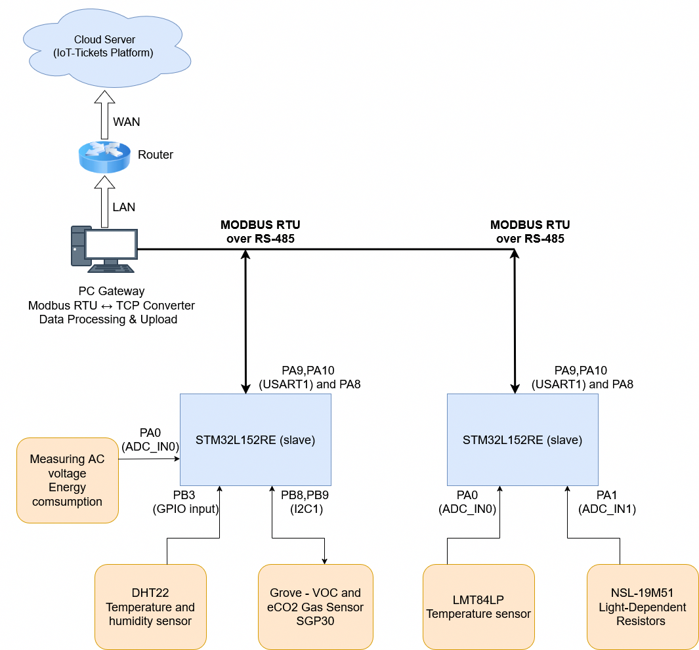

# IoT-Modbus-STM32-project (this project is a work in progress)

## 1. Introduction
This project showcases a compact but realistic home‑automation system built with STM32 microcontrollers, Modbus RTU over RS‑485, and cloud integration via an IoT gateway. Each STM32 node gathers sensor data—temperature, humidity, light, CO₂, and AC voltage—and sends it to a PC gateway for processing and visualisation. The setup highlights practical embedded engineering: real‑time operation, safe hardware design, reliable communication, and a scalable architecture suitable for smart‑home or educational use.

   
  <b>The General Project Architecture</b>

